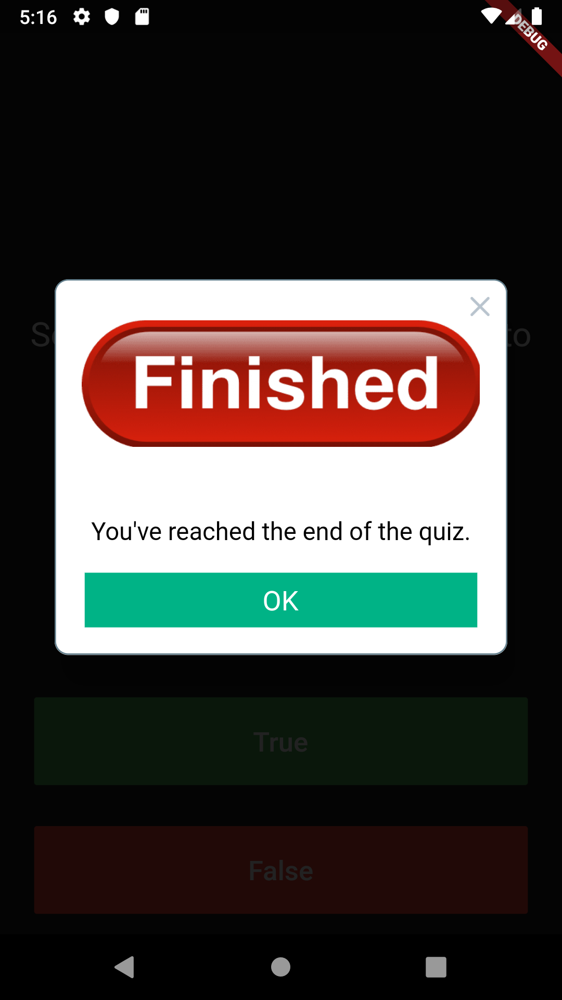

# Quizzler 

## Goal

Reviewing Stateful and Stateless Widgets as well as learning about the fundamental building blocks of Object Oriented Programming (OOP) - Classes and Objects. 

## Features

Making a quiz app that tests your general knowledge. As one of the most popular types of apps on the app stores, create quiz for other people to enjoy!

## Customized

## 

- Modularising your code into separate classes.
- Dart classes and objects.
- Using class constructors.
- Extracting Widgets to refactor your code.
- private and public modifiers in Dart.
- How to use Dart lists.
- The difference between var, const and final.

>This is a companion project to The App Brewery's Complete Flutter Development Bootcamp, check out the full course at [www.appbrewery.co](https://www.appbrewery.co/)

